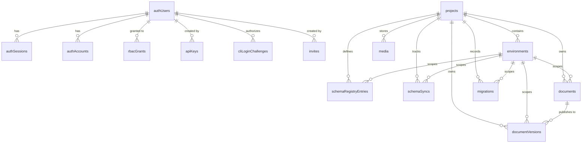
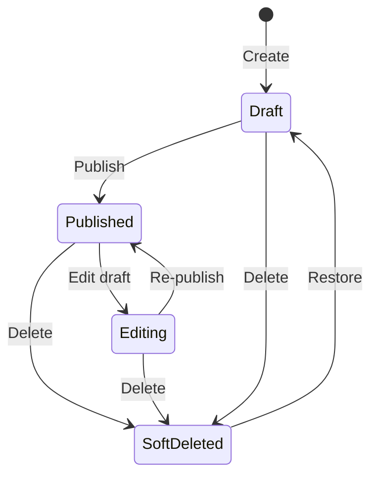

MDCMS stores all content, schema metadata, authentication state, and access control grants in PostgreSQL. This page documents the complete data model, the content lifecycle state machine, and the localization architecture.

## Entity-Relationship Diagram

The following diagram shows all tables and their primary relationships.



## Core Tables

The database schema is organized into four domains: authentication, authorization, project/environment management, and content.

### Authentication

| Table | Description |
| --- | --- |
| `authUsers` (users) | User accounts with name, email, email verification status, and avatar. |
| `authSessions` (sessions) | Active login sessions with token, expiry, IP address, and user agent. Cascade-deleted when the user is removed. |
| `authAccounts` (accounts) | OAuth/OIDC provider links (provider id, access/refresh/id tokens, scopes, or password hash for credential accounts). |
| `authVerifications` (verifications) | Time-limited verification tokens for email confirmation and password reset flows. |
| `authLoginBackoffs` (auth_login_backoffs) | Progressive login rate limiting. Tracks failure count, timestamps, and next-allowed-at per login key. |
| `cliLoginChallenges` (cli_login_challenges) | Device-flow login challenges for the CLI. Status transitions: `pending` -> `authorized` -> `exchanged`. 10-minute TTL. |

### Authorization

| Table | Description |
| --- | --- |
| `rbacGrants` (rbac_grants) | Role-based access grants. Each grant binds a user to a role (`owner`, `admin`, `editor`, `viewer`) at a scope (`global`, `project`, or `folder_prefix`). Supports soft revocation via `revokedAt`. |
| `apiKeys` (api_keys) | API key credentials. Stores a key prefix (for display), a hash (for lookup), an array of operation scopes, and a `contextAllowlist` restricting which project/environment pairs the key can target. |
| `invites` (invites) | Pending user invitations with pre-defined RBAC grants, token hash, expiry, and acceptance/revocation tracking. |

### Project and Environment

| Table | Description |
| --- | --- |
| `projects` | Top-level tenants identified by slug. Each project owns all subordinate resources. |
| `environments` | Named content spaces within a project (e.g., `production`, `staging`). Unique per project. |
| `schemaSyncs` | Tracks the last schema synchronization per project/environment. Stores the schema hash and a raw config snapshot. |
| `schemaRegistryEntries` | Per-type schema records. Each entry stores the schema type name, directory, localization flag, schema hash, and the resolved JSON Schema. Unique per project/environment/type. |

### Content

| Table | Description |
| --- | --- |
| `documents` | The mutable head state of every content document. This is the working copy. |
| `documentVersions` | Immutable publish snapshots. Each row captures the full document state at the moment of publication. |
| `media` | File metadata for uploaded assets (filename, MIME type, size, S3 key, public URL). Scoped to project. |
| `migrations` | Records of applied content migrations (name, schema type, documents affected, applied-by/at). |

## Document Table Columns

The `documents` table is the central content table. Each row represents the current draft state of a single document.

| Column | Type | Description |
| --- | --- | --- |
| `documentId` | UUID (PK) | Stable identifier for the document across its entire lifecycle. |
| `translationGroupId` | UUID | Links locale variants of the same logical content. All translations share this ID. |
| `projectId` | UUID (FK) | Owning project. |
| `environmentId` | UUID (FK) | Owning environment. |
| `path` | text | Filesystem-relative path (e.g., `content/blog/hello-world`). Unique per project/environment/locale when not deleted. |
| `schemaType` | text | Content type name matching a `schemaRegistryEntries` record. |
| `locale` | text | BCP 47 locale code, or `__mdcms_default__` for non-localized types. |
| `contentFormat` | text | `md` or `mdx`. Constrained by database check. |
| `body` | text | The Markdown/MDX body content. |
| `frontmatter` | JSONB | Structured metadata fields defined by the schema type. |
| `isDeleted` | boolean | Soft-delete flag. Deleted documents are excluded from all active queries via partial indexes. |
| `hasUnpublishedChanges` | boolean | `true` when the draft diverges from the latest published version. |
| `publishedVersion` | integer (FK) | Points to the latest `documentVersions.version` for this document, or `null` if never published. |
| `draftRevision` | bigint | Monotonically increasing revision counter for optimistic concurrency control. |
| `createdBy` | UUID | User who created the document. |
| `createdAt` | timestamptz | Creation timestamp. |
| `updatedBy` | UUID | User who last modified the document. |
| `updatedAt` | timestamptz | Last modification timestamp. |

## Content Lifecycle

MDCMS uses a two-table model for content management. The `documents` table holds the mutable head (working copy), while `documentVersions` holds immutable publish snapshots. This separation enables draft editing without affecting published content.

### State Machine



### State Transitions

| Transition | What changes |
| --- | --- |
| **Create** | New row in `documents` with `hasUnpublishedChanges = true`, `publishedVersion = null`, `draftRevision = 1`. |
| **Edit draft** | `documents` row updated: `body`, `frontmatter`, `updatedBy`, `updatedAt` change. `draftRevision` increments. `hasUnpublishedChanges` set to `true`. |
| **Publish** | New row in `documentVersions` capturing the full document state. `documents.publishedVersion` updated to new version number. `hasUnpublishedChanges` set to `false`. |
| **Re-publish** | Same as Publish -- a new immutable version row is created. |
| **Delete** | `documents.isDeleted` set to `true`. The document is excluded from all active-scoped indexes. No data is removed. |
| **Restore** | `documents.isDeleted` set to `false`. The document re-enters the Draft state with `hasUnpublishedChanges = true`. |

<Note>
Published versions are **never modified or deleted**. The `documentVersions` table is append-only, providing a complete audit trail of every publication.
</Note>

### Concurrency Control

MDCMS uses optimistic concurrency via the `draftRevision` column. Every write request must include the current `draftRevision` value. The server atomically increments the revision on update and rejects any request whose revision does not match the current database value.

```
Client reads document (draftRevision: 5)
Client sends update with draftRevision: 5
Server: WHERE draftRevision = 5 → UPDATE SET draftRevision = 6 ✓

Stale client sends update with draftRevision: 4
Server: WHERE draftRevision = 4 → 0 rows affected → 409 Conflict ✗
```

<Warning>
The Studio editor automatically handles revision tracking. If you are building a custom integration, always read the current `draftRevision` before writing and include it in update requests.
</Warning>

## Localization Architecture

MDCMS implements localization through translation groups -- a logical grouping of locale-specific document variants that represent the same content in different languages.

### Translation Groups

The `translationGroupId` column links all locale variants of a document. When you create a translation, a new `documents` row is created with:

- The same `translationGroupId` as the source document
- A different `locale` value
- Independent `body`, `frontmatter`, `publishedVersion`, and lifecycle state

Each translation is a fully independent document. Publishing the English variant does not affect the French variant. Deleting one translation does not delete others.

### Default Locale

Content types that are not localized (no `localized: true` in the schema definition) use the sentinel locale value `__mdcms_default__`. This ensures a consistent data model regardless of whether a type supports multiple languages.

### Locale Normalization

MDCMS normalizes all locale values to BCP 47 format (e.g., `en-US`, `fr-FR`, `ja`). The normalization is applied at write time, ensuring consistent locale handling across the API, CLI, and Studio.

### CLI File Mapping

The CLI maps documents to filesystem paths based on locale:

| Type | File pattern | Example |
| --- | --- | --- |
| Localized | `<path>.<locale>.<ext>` | `content/blog/hello.en-US.mdx` |
| Non-localized | `<path>.<ext>` | `content/authors/jane.md` |

<Tip>
The `supportedLocales` and `defaultLocale` fields in the Studio mount context control which locales appear in the locale picker and which locale is selected by default when creating new documents.
</Tip>
