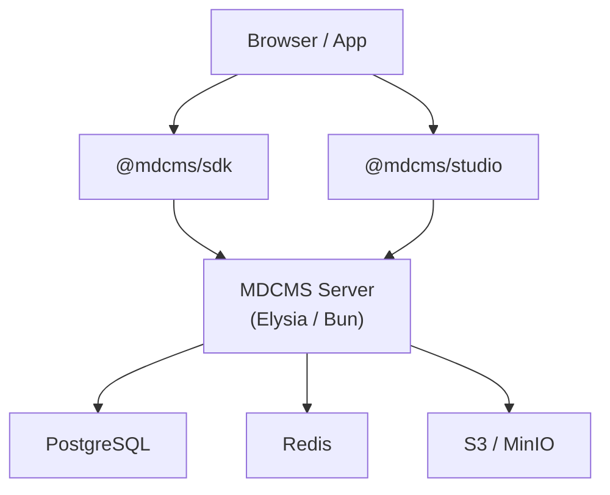
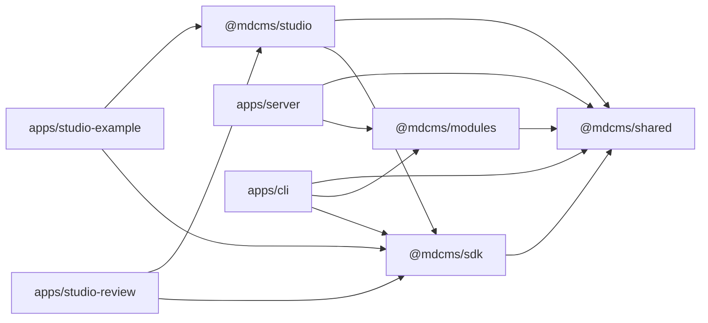

MDCMS is an open-source headless CMS that treats a PostgreSQL database as the source of truth for structured Markdown and MDX content. This page describes the design principles, deployment topology, technology choices, and monorepo structure that underpin the system.

## Design Principles

MDCMS follows a small set of architectural invariants that inform every subsystem.

| Principle                       | What it means                                                                                                                                                                                                |
| ------------------------------- | ------------------------------------------------------------------------------------------------------------------------------------------------------------------------------------------------------------ |
| **Database is source of truth** | Content lives in PostgreSQL, not the filesystem. The CLI syncs files to and from the database via `mdcms push` / `mdcms pull`.                                                                               |
| **Schema-driven UI**            | Content types are defined in TypeScript with Zod. The schema drives form generation, validation, API behavior, and Studio rendering automatically.                                                           |
| **Explicit target routing**     | Every API request carries a project and environment context via `X-MDCMS-Project` and `X-MDCMS-Environment` headers. There is no implicit "current" tenant.                                                  |
| **Code-first configuration**    | All configuration lives in `mdcms.config.ts` -- a TypeScript file that is type-checked and version-controlled alongside application code.                                                                    |
| **CQRS-lite**                   | Writes flow through command handlers that enforce validation, authorization, and versioning. Reads flow through query handlers that project data for specific consumers. The same database backs both paths. |

## Deployment Topology

A production MDCMS deployment consists of the server process, a PostgreSQL database, a Redis instance for session caching and rate limiting, and S3-compatible object storage for media assets. Clients interact through the TypeScript SDK or the embedded Studio component.



<Note>
  In local development, `docker-compose.dev.yml` starts PostgreSQL, Redis, and
  MinIO automatically. The server, Studio, and studio-example app run via `bun
  run dev`.
</Note>

## Technology Stack

Every technology choice has a specific justification. The table below documents the role and rationale for each dependency.

| Technology         | Version | Role                   | Why                                                                                     |
| ------------------ | ------- | ---------------------- | --------------------------------------------------------------------------------------- |
| **Bun**            | 1.3+    | Runtime                | Fast startup, native TypeScript execution, built-in test runner.                        |
| **TypeScript**     | 5.9     | Language               | End-to-end type safety across server, CLI, SDK, and Studio.                             |
| **Nx**             | 22.5    | Monorepo orchestration | Task caching, dependency graph, parallel builds.                                        |
| **Elysia**         | 1.4     | HTTP framework         | End-to-end type safety with Bun-native performance.                                     |
| **PostgreSQL**     | 15+     | Primary database       | JSONB for frontmatter, full-text search, append-only versioning via `documentVersions`. |
| **Drizzle ORM**    | 0.45    | Database access        | Schema-as-code migrations, type-safe query builder.                                     |
| **better-auth**    | 1.5     | Authentication         | Session management, OIDC/SAML SSO, CSRF protection.                                     |
| **Redis**          | 7       | Cache / rate limiting  | Session cache, login backoff tracking.                                                  |
| **S3 (MinIO dev)** | --      | Media storage          | Stores uploaded images and files. MinIO provides local S3-compatible development.       |
| **React**          | 19      | Studio UI              | Component model for the embeddable CMS editor.                                          |
| **Next.js**        | 15.2    | Studio host            | Server-rendered Studio example app and review environment.                              |
| **TailwindCSS**    | 4.2     | Styling                | Utility-first CSS for consistent Studio design.                                         |
| **TipTap**         | 3.7     | Rich text editor       | Extensible, ProseMirror-based MDX editing with custom node support.                     |
| **Radix UI**       | --      | Accessible primitives  | Headless UI components for dialogs, menus, popovers, and form controls.                 |
| **Zod**            | 4.3     | Validation             | Schema definition with Standard Schema interface for cross-boundary validation.         |

## Monorepo Structure

MDCMS is an Nx-managed Bun workspace. The repository is organized into `apps/` (deployable applications) and `packages/` (shared libraries).

```
mdcms/
├── apps/
│   ├── server/           # Elysia HTTP server (the CMS API)
│   ├── cli/              # `mdcms` CLI tool for push/pull/schema sync/migrate
│   ├── studio-example/   # Next.js reference app embedding @mdcms/studio
│   ├── studio-review/    # Scenario-based visual review environment for Studio
│   └── docs/             # Mintlify documentation site (you are here)
├── packages/
│   ├── shared/           # Runtime utilities, contracts, error types, validation
│   ├── sdk/              # TypeScript SDK for querying the MDCMS API
│   ├── studio/           # Embeddable React component (TipTap editor, forms, UI)
│   └── modules/          # Module registry and first-party module implementations
├── scripts/              # CI/CD helpers and integration test runners
├── docker-compose.yml    # Production-like compose configuration
├── docker-compose.dev.yml # Local development services (PG, Redis, MinIO)
├── nx.json               # Nx workspace configuration
└── package.json          # Root workspace definition
```

## Package Dependency Graph

The packages and apps form a directed dependency graph. Core contracts flow from `shared` outward; higher-level packages never depend on apps.



<Tip>
  Run `bun nx graph` at the repository root to see the live, interactive
  dependency graph in your browser.
</Tip>
