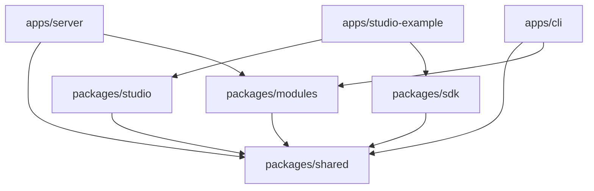

MDCMS is organized as a Bun monorepo with Nx for task orchestration. The workspace is split into four applications and four shared packages.

## Overview

The root `package.json` declares workspaces:

```json
{
  "workspaces": ["apps/*", "packages/*"]
}
```

Bun handles dependency resolution and linking. Nx manages build ordering, caching, and parallel task execution across the workspace.

## Dependency Graph



## Applications

### apps/server

|                 |                     |
| --------------- | ------------------- |
| **Package**     | `@mdcms/server`     |
| **Entry**       | `src/index.ts`      |
| **Port**        | 4000                |
| **Dev command** | `bun nx dev server` |

The Elysia HTTP server is the core of MDCMS. It exposes the REST API for content CRUD, schema registry, authentication, media uploads, webhooks, and environment management.

Key dependencies: Elysia, Drizzle ORM, better-auth, `@mdcms/shared`, `@mdcms/modules`.

### apps/cli

|                 |                  |
| --------------- | ---------------- |
| **Package**     | `@mdcms/cli`     |
| **Binary**      | `mdcms`          |
| **Dev command** | `bun nx dev cli` |

The command-line tool for managing MDCMS projects from your terminal or CI/CD pipelines.

Available commands:

| Command       | Description                                 |
| ------------- | ------------------------------------------- |
| `init`        | Interactive project setup wizard            |
| `login`       | Authenticate via browser OAuth flow         |
| `logout`      | Clear stored credentials                    |
| `push`        | Push local content to the server            |
| `pull`        | Pull content from the server to local files |
| `schema-sync` | Sync schema definitions to the server       |
| `status`      | Show sync status between local and server   |
| `migrate`     | Run content migrations                      |

Dependencies: `@mdcms/shared`, `@mdcms/modules`.

### apps/studio-example

|                 |                             |
| --------------- | --------------------------- |
| **Package**     | `@mdcms/studio-example`     |
| **Framework**   | Next.js 15.2                |
| **Port**        | 4173                        |
| **Dev command** | `bun nx dev studio-example` |

A demo Next.js application that embeds the `<Studio />` component from `@mdcms/studio`. Used for local development and testing of the Studio UI. Not published to any registry.

Dependencies: `@mdcms/studio`, `@mdcms/sdk`.

## Shared Packages

### packages/shared

|             |                 |
| ----------- | --------------- |
| **Package** | `@mdcms/shared` |

The foundational package that all other packages depend on. Contains contracts, types, and utilities shared across the entire monorepo.

Key exports:

| Export                 | Purpose                                     |
| ---------------------- | ------------------------------------------- |
| `defineConfig`         | Configuration builder for `mdcms.config.ts` |
| `defineType`           | Content type definition helper              |
| `reference`            | Typed reference field helper                |
| `API_V1_BASE_PATH`     | API version path constant                   |
| `RuntimeError`         | Base error class for structured errors      |
| Content response types | TypeScript types for API responses          |
| Schema types           | TypeScript types for schema definitions     |

### packages/sdk

|             |              |
| ----------- | ------------ |
| **Package** | `@mdcms/sdk` |

The TypeScript client SDK for querying MDCMS content from your application at build time or runtime.

Key exports:

| Export             | Purpose                                               |
| ------------------ | ----------------------------------------------------- |
| `createClient`     | Factory function to create a configured MDCMS client  |
| `MdcmsApiError`    | Error class for API-level errors                      |
| `MdcmsClientError` | Error class for client-level errors (network, config) |

Dependencies: `@mdcms/shared`.

### packages/studio

|             |                 |
| ----------- | --------------- |
| **Package** | `@mdcms/studio` |

The embeddable React UI component that provides the full visual editing experience -- dashboard, content editor, media management, and settings.

Built with:

| Library              | Purpose                         |
| -------------------- | ------------------------------- |
| React 19             | UI framework                    |
| TipTap 3.7           | Rich text / MDX editor          |
| Radix UI             | Accessible component primitives |
| TailwindCSS          | Styling                         |
| TanStack React Query | Server state management         |
| Lucide               | Icon library                    |

Dependencies: `@mdcms/shared`.

### packages/modules

|             |                  |
| ----------- | ---------------- |
| **Package** | `@mdcms/modules` |

The module registry that provides extensibility. Modules can register server actions, CLI commands, and Studio UI extensions.

Built-in modules:

| Module           | Description               |
| ---------------- | ------------------------- |
| `core.system`    | Core system functionality |
| `domain.content` | Content domain operations |

Dependencies: `@mdcms/shared`.
