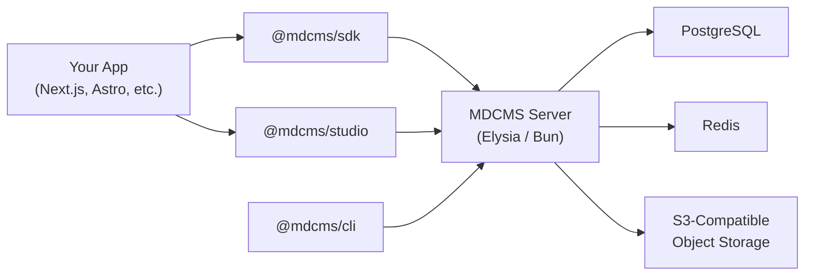

This page covers every core concept in MDCMS. After reading it, you should be able to reason about how projects, environments, content types, documents, localization, references, and access control fit together.

## Projects

A **project** is the top-level tenant in MDCMS. Each project owns its own content, schema, environments, users, and API keys. Projects are identified by a slug (e.g., `marketing-site`, `developer-docs`).

You set the project in your config file:

```typescript mdcms.config.ts
import { defineConfig } from "@mdcms/cli";

export default defineConfig({
  project: "marketing-site",
  serverUrl: "http://localhost:4000",
  // ...
});
```

All CLI commands, SDK queries, and Studio sessions operate within the scope of a single project. If you manage multiple sites or products, create a separate project for each.

## Environments

An **environment** is an isolated content space within a project. Typical setups use `production`, `staging`, and `development`, but you can define any set of environments.

Every project starts with a `production` environment. Additional environments are declared in `mdcms.config.ts`:

```typescript mdcms.config.ts
import { defineConfig, defineType } from "@mdcms/cli";
import { z } from "zod";

const BlogPost = defineType("BlogPost", {
  directory: "content/blog",
  fields: {
    title: z.string().min(1),
    slug: z.string().min(1),
    featured: z.boolean().default(false).env("staging"),
    abTestVariant: z.string().optional().env("staging"),
  },
});

export default defineConfig({
  project: "marketing-site",
  serverUrl: "http://localhost:4000",
  contentDirectories: ["content"],
  environments: {
    production: {},
    staging: {
      extends: "production",
    },
  },
  types: [BlogPost],
});
```

Key properties of environments:

- **Isolation** -- Each environment has its own documents. Editing content in `staging` does not affect `production`.
- **Schema overlays** -- Environments that `extend` another inherit the base schema and can add, modify, or omit fields. In the example above, `staging` extends `production` and adds `featured` and `abTestVariant` fields via the `.env("staging")` sugar.
- **Clone & promote** -- You can clone all content from one environment to another, or promote a subset of documents between environments.

<Note>
  The `environment` field in the config selects which environment the CLI
  operates against by default. If omitted, operations target `production`.
</Note>

## Content Types (Schema)

Content types define the shape of your content. They are declared in `mdcms.config.ts` using `defineType()` with [Zod](https://zod.dev) validators:

```typescript mdcms.config.ts
import { defineConfig, defineType, reference } from "@mdcms/cli";
import { z } from "zod";

const Author = defineType("Author", {
  directory: "content/authors",
  fields: {
    name: z.string().min(1),
    bio: z.string().optional(),
    website: z.string().url().optional(),
  },
});

const BlogPost = defineType("BlogPost", {
  directory: "content/blog",
  localized: true,
  fields: {
    title: z.string().min(1).max(200),
    slug: z.string().regex(/^[a-z0-9-]+$/),
    excerpt: z.string().max(500).optional(),
    author: reference("Author"),
    publishedAt: z.coerce.date(),
    tags: z.array(z.string()).default([]),
  },
});

export default defineConfig({
  project: "marketing-site",
  serverUrl: "http://localhost:4000",
  contentDirectories: ["content"],
  types: [Author, BlogPost],
});
```

Each `defineType()` call accepts:

| Parameter   | Description                                                                                 |
| ----------- | ------------------------------------------------------------------------------------------- |
| `name`      | Unique type identifier (first argument). Used in API queries and references.                |
| `directory` | Filesystem directory where documents of this type live (relative to a content directory).   |
| `localized` | When `true`, documents of this type support multiple locale variants.                       |
| `fields`    | A record of Zod schemas. Each field becomes a frontmatter property and a Studio form field. |

The schema drives three things:

1. **Form generation** -- Studio renders appropriate input controls (text fields, date pickers, toggles, reference selectors) based on the Zod type of each field.
2. **Validation** -- Both the CLI and server validate frontmatter against the schema before accepting content.
3. **API behavior** -- The API exposes schema metadata so clients can introspect available types and their fields.

After modifying your types, sync the schema to the server:

```bash
mdcms schema sync
```

## Documents

A **document** is an instance of a content type. It consists of structured frontmatter (validated against the schema) and a Markdown or MDX body.

| Property             | Description                                                                                              |
| -------------------- | -------------------------------------------------------------------------------------------------------- |
| `documentId`         | Stable UUID. The true identity of a document -- never changes, even if the path does.                    |
| `translationGroupId` | UUID that links locale variants of the same logical content together.                                    |
| `path`               | Mutable, filesystem-like path (e.g., `content/blog/hello-world`). Can be renamed without losing history. |
| `locale`             | BCP 47 language tag (e.g., `en`, `fr`, `ja`). Set to `__mdcms_default__` for non-localized types.        |
| `format`             | `md` for standard Markdown, `mdx` for MDX with component support.                                        |
| `frontmatter`        | JSON object containing structured data that matches the content type schema.                             |
| `body`               | The Markdown or MDX content string.                                                                      |

<Tip>
  Because `documentId` is stable, you can safely reference documents by ID in
  your application code. The `path` is designed for human readability and
  filesystem mapping, but should not be treated as a permanent identifier.
</Tip>

On disk, a document looks like a standard Markdown file with YAML frontmatter:

```markdown content/blog/hello-world.mdx
---
title: Hello World
slug: hello-world
author: 11111111-1111-1111-1111-111111111111
publishedAt: 2026-01-15
tags:
  - announcements
  - getting-started
---

Welcome to our blog. This is the first post.
```

## Draft/Publish Workflow

Every document follows a draft/publish lifecycle that tracks changes through immutable version snapshots.

<Steps>
  <Step title="Create">
    A new document starts as a **draft**. It has no published version and is
    only visible to users with `content:read:draft` permission.
  </Step>
  <Step title="Edit">
    Edits are auto-saved. Each save increments the `draftRevision` counter.
    Drafts do not create version history entries -- they represent work in
    progress.
  </Step>
  <Step title="Publish">
    Publishing creates an **immutable version snapshot**. The `version` number
    increments and the snapshot captures the full frontmatter and body at that
    point in time. You can attach an optional change summary to each published
    version.
  </Step>
  <Step title="Continue Editing">
    After publishing, further edits create new draft revisions on top of the
    published version. The published content remains stable and visible to
    readers.
  </Step>
  <Step title="Re-publish">
    Publishing again creates a new version snapshot. The full version history is
    preserved, allowing you to review or compare any previous published state.
  </Step>
</Steps>

<Note>
  The `hasUnpublishedChanges` flag on a document tells you whether the current
  draft differs from the latest published version. This is useful for building
  editorial dashboards that show pending changes.
</Note>

## Localization

MDCMS supports content localization at the type level. When a content type is defined with `localized: true`, each document can have independent locale variants.

```typescript
const Campaign = defineType("Campaign", {
  directory: "content/campaigns",
  localized: true,
  fields: {
    title: z.string().min(1),
    slug: z.string().min(1),
    summary: z.string().min(1),
  },
});
```

Locale configuration is set globally in the config:

```typescript
export default defineConfig({
  project: "marketing-site",
  serverUrl: "http://localhost:4000",
  contentDirectories: ["content"],
  locales: {
    default: "en",
    supported: ["en", "fr", "ja"],
    aliases: {
      "en-US": "en",
      "en-GB": "en",
    },
  },
  types: [Campaign],
});
```

How localized documents work:

- Each locale variant is a **separate document** with its own `documentId`, `path`, `body`, `frontmatter`, and version history.
- Locale variants are linked by a shared `translationGroupId`. This lets the Studio display a locale switcher and the API return all variants of a piece of content.
- Each variant can be at a different stage in the draft/publish workflow. Publishing the English version does not affect the French draft.
- The SDK accepts a `locale` parameter to query content in a specific language.

<Warning>
  Non-localized types (where `localized` is `false` or omitted) operate in
  implicit single-locale mode. Their documents use the internal locale token
  `__mdcms_default__` and do not participate in translation groups.
</Warning>

## References

The `reference()` helper creates a typed relationship between content types. A reference field stores the `documentId` of the target document.

```typescript
const BlogPost = defineType("BlogPost", {
  directory: "content/blog",
  fields: {
    title: z.string().min(1),
    author: reference("Author"),
    relatedPosts: z.array(reference("BlogPost")).default([]),
  },
});
```

How references are resolved:

- **At rest**, reference fields store raw UUID strings (the target document's `documentId`).
- **At query time**, you can request resolution via the `resolve` parameter in the API or SDK. Resolution is **shallow** (one level deep) -- it replaces the UUID with the target document's data but does not recursively resolve references within the resolved document.
- **Unresolved references** return `null` in the frontmatter and include an error entry in the `resolveErrors` object on the response.

Reference resolution error codes:

| Error Code                | Meaning                                                                                        |
| ------------------------- | ---------------------------------------------------------------------------------------------- |
| `REFERENCE_NOT_FOUND`     | The referenced document does not exist in the target project/environment.                      |
| `REFERENCE_DELETED`       | The referenced document has been soft-deleted.                                                 |
| `REFERENCE_TYPE_MISMATCH` | The referenced document's type does not match the expected target type declared in the schema. |
| `REFERENCE_FORBIDDEN`     | The current API key or user does not have read access to the referenced document.              |

<Tip>
  References can be optional (`reference("Author").optional()`) or collected in
  arrays (`z.array(reference("BlogPost"))`). The resolution engine handles both
  forms.
</Tip>

## API Keys

API keys provide scoped, token-based access to the MDCMS API. They are the primary authentication mechanism for server-to-server integrations and CI/CD pipelines.

Each API key has:

| Property           | Description                                                          |
| ------------------ | -------------------------------------------------------------------- |
| `label`            | Human-readable name (e.g., "Production Read-Only", "CI Deploy Key"). |
| `scopes`           | List of permitted operations.                                        |
| `contextAllowlist` | Restricts the key to specific project/environment pairs.             |
| `expiresAt`        | Optional expiration timestamp.                                       |

API keys are prefixed with `mdcms_key_` for easy identification in logs and secret scanners.

### Available Scopes

<Accordion title="Full list of API key scopes">

| Scope                  | Description                           |
| ---------------------- | ------------------------------------- |
| `content:read`         | Read published content.               |
| `content:read:draft`   | Read draft (unpublished) content.     |
| `content:write`        | Create and update content.            |
| `content:write:draft`  | Create and update draft content.      |
| `content:publish`      | Publish documents.                    |
| `content:delete`       | Delete documents.                     |
| `schema:read`          | Read schema registry entries.         |
| `schema:write`         | Sync schema changes.                  |
| `media:upload`         | Upload media files.                   |
| `media:delete`         | Delete media files.                   |
| `webhooks:read`        | List webhook configurations.          |
| `webhooks:write`       | Create, update, and delete webhooks.  |
| `environments:clone`   | Clone content between environments.   |
| `environments:promote` | Promote content between environments. |
| `migrations:run`       | Execute content migrations.           |
| `projects:read`        | Read project metadata.                |
| `projects:write`       | Update project settings.              |

</Accordion>

A typical production frontend key would use only `content:read` and `schema:read` scopes, locked to the `production` environment via the context allowlist.

## RBAC Roles

MDCMS uses role-based access control for user permissions. Roles are hierarchical -- each role includes all permissions of the roles below it.

| Permission           | Viewer | Editor | Admin | Owner |
| -------------------- | ------ | ------ | ----- | ----- |
| `content:read`       | Yes    | Yes    | Yes   | Yes   |
| `content:read:draft` |        | Yes    | Yes   | Yes   |
| `content:write`      |        | Yes    | Yes   | Yes   |
| `content:publish`    |        | Yes    | Yes   | Yes   |
| `content:unpublish`  |        | Yes    | Yes   | Yes   |
| `content:delete`     |        | Yes    | Yes   | Yes   |
| `schema:read`        | Yes    | Yes    | Yes   | Yes   |
| `schema:write`       |        |        | Yes   | Yes   |
| `projects:read`      | Yes    | Yes    | Yes   | Yes   |
| `projects:write`     |        |        | Yes   | Yes   |
| `user:manage`        |        |        | Yes   | Yes   |
| `settings:manage`    |        |        | Yes   | Yes   |

### Scope and Constraints

- **Viewer** and **Editor** roles can be scoped to a specific project, or even a folder prefix within a project/environment. This allows fine-grained access like "editor for `content/blog/` in `production`".
- **Admin** and **Owner** roles are always instance-wide (global scope).
- Exactly **one Owner** must exist at all times. The system prevents removing or demoting the last Owner.

## Architecture at a Glance

The following diagram shows how the main MDCMS components connect:



| Component                 | Role                                                                                                                           |
| ------------------------- | ------------------------------------------------------------------------------------------------------------------------------ |
| **MDCMS Server**          | Elysia-based HTTP API running on Bun. Handles content CRUD, schema registry, auth, webhooks, and media.                        |
| **@mdcms/cli**            | Command-line tool for schema sync, content push/pull, migrations, and project initialization.                                  |
| **@mdcms/sdk**            | TypeScript client for querying content from your application at build time or runtime.                                         |
| **@mdcms/studio**         | Embeddable React component that provides the visual editing interface. Communicates directly with the server.                  |
| **PostgreSQL**            | Primary data store for all content, schema metadata, users, API keys, and version history.                                     |
| **Redis**                 | Used for session management, caching, and real-time features.                                                                  |
| **S3-Compatible Storage** | Stores uploaded media files (images, documents, etc.). Works with AWS S3, MinIO, Cloudflare R2, or any S3-compatible provider. |
