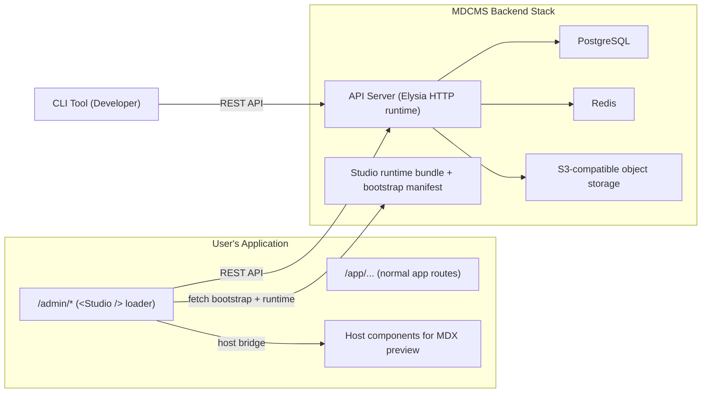
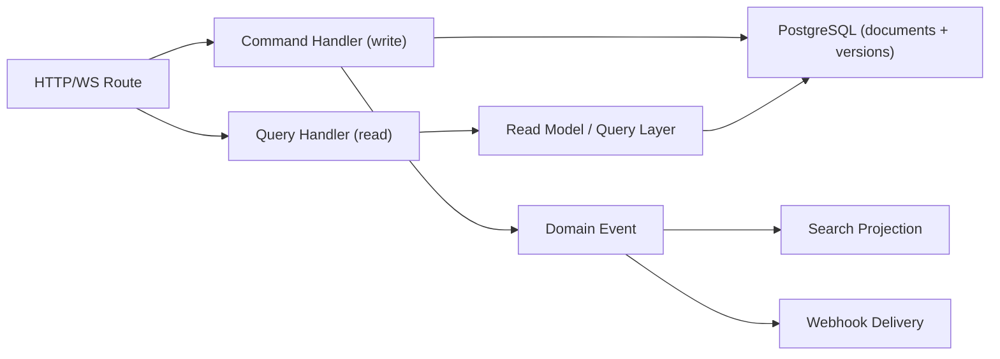

# SPEC-002 System Architecture and Extensibility

This is the live canonical document under `docs/`.

## Architecture

### Deployment Topology

MDCMS consists of two deployable units:

1. **Backend Server** — A standalone, self-hosted server process. Provides the REST API, Studio runtime delivery, module/action surfaces, and all business logic. Runs as a Docker Compose stack alongside PostgreSQL, Redis, and S3-compatible object storage. Post-MVP, the same deployment may also host collaboration/presence WebSocket services.

2. **Studio UI (Approach C)** — A React component (`<Studio />`) from `@mdcms/studio`, embedded in the user's app at a catch-all route (for example `/admin/*`). The component acts as a thin loader shell: it fetches a backend-served Studio runtime bundle, verifies compatibility and integrity, provides the host bridge plus `basePath`, and executes the remote Studio app in-process through the module runtime contract. Host app integration remains required for MDX custom component preview. Cross-origin embedding is a first-class path; the backend is not required to share the host app origin.



### Future Considerations

The architecture should be designed so that a multi-tenant SaaS cloud version could be built on top of it in the future. This is not planned or in scope, but the design should not preclude it.

### Unified Extensibility Contract + Studio Delivery (v1)

MDCMS uses a unified feature-module package model for backend and CLI, and an Approach C delivery model for Studio runtime.

**v1 rules:**

- Backend is the source of truth for action execution and authorization.
- Modules are first-party only in v1 (workspace/local private npm dependencies).
- Server and CLI module surfaces are compile-time local.
- Studio is delivered via backend-served runtime bundle loaded by npm package `@mdcms/studio`.
- Studio runtime execution is `module`-only in MVP.

**Module manifest and package contract (server + CLI):**

```typescript
export type ModuleKind = "domain" | "core";

export type ModuleManifest = {
  id: string;
  version: string;
  apiVersion: "1";
  kind?: ModuleKind;
  dependsOn?: string[];
  minCoreVersion?: string;
  maxCoreVersion?: string;
};

export type MdcmsModulePackage = {
  manifest: ModuleManifest;
  server?: ServerSurface;
  cli?: CliSurface;
};
```

### Server Surface (Source of Truth)

The server defines actions and permissions, publishes the action catalog contract (`/actions`, `/actions/:id`), and is authoritative for authorization and execution.

```typescript
export type ServerSurface = {
  mount: (app: Elysia, deps: AppDeps) => void;
  actions?: ActionDefinition[];
};

type JsonSchema = Record<string, unknown>;

export type ActionDefinition = {
  id: string;
  kind: "command" | "query";
  method: "GET" | "POST" | "PUT" | "PATCH" | "DELETE";
  path: string;
  requestSchema?: JsonSchema;
  responseSchema?: JsonSchema;
  permissions: string[];
  studio?: StudioActionMeta;
  cli?: CliActionMeta;
};
```

### CLI Surface (Action-Based Only)

CLI extensibility is action-based in v1. No arbitrary command-tree plugins.

```typescript
export type CliSurface = {
  actionAliases?: CliActionAlias[];
  outputFormatters?: CliOutputFormatter[];
  preflightHooks?: CliPreflightHook[];
};
```

CLI default behavior comes from backend action metadata; module-level CLI aliases/formatters are optional overlays.

### Composition and Dependency Model (Elysia-Native IoC)

MDCMS uses inversion of control without a DI container framework in v1. Dependencies are wired at the composition root and passed explicitly.

**Design goals:**

- Keep dependency flow explicit and type-safe.
- Avoid hidden service-locator patterns.
- Stay framework-native with Elysia plugin composition (`app.use(...)` or explicit route registration).

```typescript
type AppDeps = {
  db: Db;
  redis: Redis;
  storage: Storage;
  events: EventBus;
  logger: Logger;
  clock: () => Date;
  id: () => string;
};

type RequestDeps = AppDeps & {
  actor: AuthActor | null;
  project: string;
  environment: string;
  requestId: string;
};
```

```typescript
const appDeps = buildAppDeps(env);
const app = new Elysia();

for (const mod of modules) {
  mod.server?.mount(app, appDeps);
}
```

### Backend Metadata Contract (Typed Action Registry + `/actions` Catalog)

The typed action registry is the canonical cross-surface contract for Studio and CLI defaults. The server exposes an authorization-filtered action catalog at:

- `GET /api/v1/actions`
- `GET /api/v1/actions/:id`

Catalog metadata is flattened and non-executable:

```typescript
type JsonSchema = Record<string, unknown>;

type ActionCatalogItem = {
  id: string;
  kind: "command" | "query";
  method: "GET" | "POST" | "PUT" | "PATCH" | "DELETE";
  path: string;
  permissions: string[];
  studio?: {
    visible?: boolean;
    surface?: string;
    label?: string;
    confirm?: string;
    form?: { mode?: "auto" | "custom"; uiHints?: Record<string, unknown> };
  };
  cli?: {
    visible?: boolean;
    alias?: string;
    inputMode?: "json-or-flags" | "json";
  };
  requestSchema?: JsonSchema;
  responseSchema?: JsonSchema;
};
```

Rules:

1. If `studio` metadata exists, Studio renders default UI automatically.
2. Studio runtime bundle may customize generated UI behavior, but authorization/execution remain backend-authoritative.
3. If `cli.visible=true`, CLI exposes the action via generic runner and alias map.
4. `requestSchema` and `responseSchema` are inline JSON Schema objects in the catalog payload.
5. `/actions` returns only actions visible to the current caller.

### Runtime Data Flow (Approach C)

1. Build step bundles local module packages for server and CLI.
2. Server boots, validates manifests, mounts server surfaces, and publishes typed action catalog endpoints.
3. Server publishes Studio bootstrap startup outcomes and runtime artifacts, and owns `active`, optional `lastKnownGood`, and operator kill-switch publication state.
4. Host app embeds `@mdcms/studio` (`<Studio />`) at a catch-all route and provides the Studio subtree root as `basePath`.
5. The loader shell fetches one bootstrap startup outcome, verifies manifest signature/hash/compatibility, performs the required allowlisted browser-origin requests, loads the runtime bundle, and calls the remote `mount(...)` contract in `module` mode.
6. If startup validation rejects the served build for integrity, signature, or compatibility reasons, the shell retries bootstrap exactly once with rejection context; the server then decides whether to serve `lastKnownGood` or return a deterministic disabled or unavailable response.
7. The remote Studio runtime owns browser-path syncing, application states, and route rendering under the provided `basePath`.
8. The remote Studio runtime reads backend action catalog metadata (`/actions`, `/actions/:id`) and renders defaults/custom behavior.
9. CLI reads backend action catalog and executes via generic action runner; local CLI aliases/formatters/preflight hooks are applied.

### Validation, Collision, and Safety Rules

1. Duplicate `manifest.id` fails startup.
2. Missing `dependsOn` target fails startup.
3. Duplicate `actionId` fails startup.
4. Bootstrap manifest signature or hash mismatch blocks Studio startup.
5. Incompatible Studio package/runtime/bridge versions block Studio startup with actionable error.
6. Unknown Studio field kind falls back to a safe JSON editor and logs a warning.
7. Duplicate normalized Studio route paths fail startup with actionable error output.
8. Slot widget collisions are allowed only when every widget declares explicit numeric `priority`; ordering is deterministic by `priority` descending, then `id` ascending.
9. `module` mode executes runtime code in host JS context and must use a capability-limited host bridge.
10. Action catalog metadata is data-only; no executable payloads in metadata.
11. Authorization is always server-enforced; Studio/CLI visibility is advisory only.
12. Build selection is always server-owned; the shell may report rejection context, but it does not persist browser-local fallback state or choose between active and fallback builds on its own.

### Versioning and Compatibility

1. `manifest.apiVersion` must match core-supported module API version.
2. `minCoreVersion` and `maxCoreVersion` are validated at startup.
3. Studio bootstrap manifest compatibility (`apiVersion`, `minStudioPackageVersion`, `minHostBridgeVersion`) is validated before runtime load.
4. Incompatible modules or Studio runtimes are blocked with explicit startup/load errors.
5. Compatibility matrix is documented and validated in CI.

### CQRS-Lite (Read/Write Separation)

MDCMS adopts CQRS-lite in v1:

- **Writes** use command handlers (`kind: "command"` actions).
- **Reads** use query handlers/services (`kind: "query"` actions).
- **Side effects** (for example future search indexing, webhooks, and audit trails) run from domain events emitted by write paths.
- No mandatory global command/query bus abstraction in v1.



### Testing Plan for Extensibility

**Contract tests**

1. Validate module manifest schema.
2. Validate Studio bootstrap manifest schema, startup-ready envelope schema, and signature verification path.
3. Validate action catalog schema (metadata shape + inline request/response schemas).
4. Validate action ID uniqueness and deterministic catalog ordering.

**Server tests**

1. Command/query action execution with permission enforcement.
2. Action catalog emission correctness.
3. Failure behavior for invalid module dependencies.

**Studio tests**

1. Bootstrap verification (signature/hash/compatibility), one-shot rejection retry, and failure fallbacks.
2. Metadata-driven default rendering correctness.
3. `module` host bridge contract and capability boundaries.
4. Deep-link routing correctness under an explicit `basePath`.
5. Composition-registry collision handling, deterministic ordering, and unknown field-kind fallback.
6. MDX preview behavior with host components.

**CLI tests**

1. Generic action runner for command and query actions.
2. Alias resolution to backend `actionId`.
3. Formatter hook behavior and error fallbacks.

**End-to-end scenarios**

1. Add a new action without custom Studio code and verify backend-driven default UI.
2. Validate server-owned Studio startup rollback to last known-good build on integrity failure.
3. Verify unauthorized action is hidden in UI and rejected by backend when forced.
4. Verify MDX custom component preview path through host bridge.

### Acceptance Criteria

1. A new backend feature appears in Studio/CLI defaults from the typed action catalog.
2. Studio runs from backend-served runtime through `@mdcms/studio` with integrity + compatibility checks.
3. CLI can run backend actions without building custom command trees.
4. Shell startup failures are deterministic, and after mount the remote runtime owns all Studio application UI states.
5. Compatibility and collisions fail fast with actionable errors.

### Implementation Sequence

1. Define shared contracts (`ModuleManifest`, `MdcmsModulePackage`, `ServerSurface`, `CliSurface`, `StudioBootstrapManifest`, `StudioBootstrapReadyResponse`, `HostBridgeV1`).
2. Implement server manifest validator and module bootstrap for server/CLI.
3. Implement typed action registry emission and `/actions` contract validation.
4. Implement Studio bootstrap startup endpoint, rejection retry contract, and signed runtime artifact pipeline.
5. Implement `@mdcms/studio` runtime loader with integrity checks, `basePath` handoff, and startup failure handling.
6. Implement the remote Studio app and runtime composition registry in `module` mode.
7. Implement CLI generic action runner with aliases/formatters/hooks.
8. Add CI checks for compatibility, contracts, and Studio runtime integrity.

### Assumptions and Defaults

1. v1 extensibility is first-party only.
2. Studio is delivered as backend-served runtime loaded via npm package `@mdcms/studio`.
3. Typed action registry endpoints (`/actions`, `/actions/:id`) remain the generated-default contract source.
4. Backend authorization remains the final authority.
5. The remote Studio runtime owns routing and application states after the shell completes startup.
6. Third-party sandboxing is a separate post-v1 phase.

---

## Tech Stack

| Layer                 | Technology                       | Notes                                                                                   |
| --------------------- | -------------------------------- | --------------------------------------------------------------------------------------- |
| **Backend Runtime**   | Bun                              | Fast, Node.js-compatible. Final choice: Bun.                                            |
| **Backend Framework** | Elysia                           | Lightweight, Bun-native. Final choice: Elysia.                                          |
| **Database**          | PostgreSQL                       | Primary data store. Append-only content storage.                                        |
| **Cache / Buffer**    | Redis                            | Session management, short-lived caches, and future collaboration buffering.             |
| **Object Storage**    | S3-compatible (MinIO for dev)    | Media files (any file type).                                                            |
| **Auth**              | better-auth                      | Email/password + OIDC + SAML.                                                           |
| **Studio UI**         | React + Shadcn/ui + Tailwind CSS | `@mdcms/studio` embedded in host app; runtime bundle served by backend (Approach C).    |
| **Editor**            | TipTap                           | Rich text editing with Markdown/MDX serialization. Real-time collaboration is Post-MVP. |
| **Schema Validation** | Standard Schema (Zod primary)    | Developer-facing schema definitions.                                                    |
| **Monorepo**          | Nx                               | Build system, caching, package management.                                              |
| **Email (dev)**       | Mailhog                          | Local email testing for auth flows.                                                     |

### Package Structure

Monorepo managed by Nx with the following packages/workspace groups:

| Workspace Path       | Description                                                                             |
| -------------------- | --------------------------------------------------------------------------------------- |
| `apps/server`        | Source location for `@mdcms/server` backend API server. Dockerized.                     |
| `apps/studio`        | Source location for `@mdcms/studio` host component and Studio runtime artifact builder. |
| `packages/sdk`       | Source location for `@mdcms/sdk` client API package. Published to npm.                  |
| `apps/cli`           | Source location for `@mdcms/cli` operator CLI package. Published to npm.                |
| `packages/shared`    | Source location for `@mdcms/shared` cross-cutting contracts and runtime helpers.        |
| `packages/modules/*` | Unified feature-module packages (server/cli surfaces in v1).                            |

### Unified Module Layout (v1)

Feature modules are packaged once and mounted by server and CLI from a shared module list. Studio customization is delivered through the Studio runtime build pipeline (Approach C), not via local per-module Studio surfaces in v1.

```txt
packages/modules/
  src/
    index.ts                    # exports installed modules[]
  <module-id>/
    src/
      manifest.ts
      server/
        index.ts
        actions/
        routes/
        schemas/
      cli/
        index.ts
        aliases/
        formatters/

apps/server/src/lib/
  module-loader.ts              # imports modules[] and mounts server surfaces
  runtime-with-modules.ts       # composes server runtime with module load report

apps/studio/src/lib/
  remote-module.ts              # Studio runtime entry (remote bundle source contract)
  build-runtime.ts              # immutable Studio artifact + bootstrap metadata generator

apps/cli/src/lib/
  module-loader.ts              # imports modules[] and mounts cli surfaces
  runtime-with-modules.ts       # composes CLI runtime with module load report
```

---

## Extensibility Contract Endpoints

| Method | Path                  | Auth Mode                              | Required Scope | Target Routing | Request         | Success                                     | Deterministic Errors                                                                                |
| ------ | --------------------- | -------------------------------------- | -------------- | -------------- | --------------- | ------------------------------------------- | --------------------------------------------------------------------------------------------------- |
| GET    | `/api/v1/actions`     | public (visibility-filtered by policy) | none           | none           | no body         | `200` `{ data: ActionCatalogListResponse }` | `NOT_FOUND` (`404`) for unsupported paths; `INTERNAL_ERROR` (`500`) for unexpected runtime failures |
| GET    | `/api/v1/actions/:id` | public (visibility-filtered by policy) | none           | none           | `id` path param | `200` `{ data: ActionCatalogItem }`         | `NOT_FOUND` (`404`) for unknown or hidden action ids                                                |

`/actions` + `/actions/:id` are the canonical runtime contract consumed by Studio and CLI.

## Action Catalog Metadata Contract

The backend action registry emits flattened metadata for Studio and CLI behavior in the catalog payload:

```typescript
type JsonSchema = Record<string, unknown>;

type ActionCatalogItem = {
  id: string;
  kind: "command" | "query";
  method: "GET" | "POST" | "PUT" | "PATCH" | "DELETE";
  path: string;
  permissions: string[];
  studio?: {
    visible?: boolean;
    surface?: string;
    label?: string;
    confirm?: string;
    form?: { mode?: "auto" | "custom"; uiHints?: Record<string, unknown> };
  };
  cli?: {
    visible?: boolean;
    alias?: string;
    inputMode?: "json-or-flags" | "json";
  };
  requestSchema?: JsonSchema;
  responseSchema?: JsonSchema;
};
```

Contract rules:

1. `id` is globally unique per server runtime.
2. `/actions` is authorization-filtered; callers only receive executable/visible actions.
3. `permissions` in metadata are advisory to clients; backend policy is authoritative.
4. Studio and CLI never execute code from metadata; metadata drives generated defaults only.
5. `requestSchema` and `responseSchema` are inline JSON Schema objects in payloads.
6. CLI generic runner accepts action input from JSON or flags based on `inputMode`.

---

## Module Surface Endpoints

| Method | Path                                     | Auth Mode | Required Scope | Target Routing | Request | Success                                          | Deterministic Errors                                      |
| ------ | ---------------------------------------- | --------- | -------------- | -------------- | ------- | ------------------------------------------------ | --------------------------------------------------------- |
| GET    | `/api/v1/modules/core-system/ping`       | public    | none           | none           | no body | `200` `{ moduleId, status, route, generatedAt }` | standard runtime envelope (`NOT_FOUND`, `INTERNAL_ERROR`) |
| GET    | `/api/v1/modules/domain-content/preview` | public    | none           | none           | no body | `200` `{ moduleId, status, route, generatedAt }` | standard runtime envelope (`NOT_FOUND`, `INTERNAL_ERROR`) |
