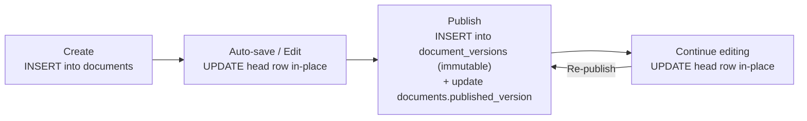

# SPEC-003 Content Storage, Versioning, and Migrations

This is the live canonical document under `docs/`.

## Content Model & Storage

### Storage Model: Two-Table Hybrid (Mutable Head + Immutable Versions)

Content is stored across two tables with different semantics:

- **`documents`** — Mutable head row per locale-scoped document. Stores current working content + lifecycle metadata, including source content format (`md`/`mdx`).
- **`document_versions`** — Immutable append-only publish history. A new row is created only when a document is **published** (including restore-to-published operations).

**`documents` table (mutable head):**

```sql
CREATE TABLE documents (
    document_id     UUID PRIMARY KEY,        -- Logical document identity (stable across lifetime)
    translation_group_id UUID NOT NULL,      -- Links locale variants of the same logical document
    project_id      UUID NOT NULL REFERENCES projects(id),      -- Which project this belongs to
    environment_id  UUID NOT NULL REFERENCES environments(id),  -- Which environment this belongs to
    path            TEXT NOT NULL,            -- e.g., "blog/hello-world"
    schema_type     TEXT NOT NULL,            -- e.g., "BlogPost"
    locale          TEXT NOT NULL,            -- Canonical BCP 47 locale tag or reserved implicit token
    content_format  TEXT NOT NULL CHECK (content_format IN ('md', 'mdx')), -- Source format used for filesystem sync
    body            TEXT NOT NULL,            -- Raw markdown/MDX content
    frontmatter     JSONB NOT NULL,          -- Structured fields per schema
    is_deleted      BOOLEAN NOT NULL DEFAULT FALSE,
    has_unpublished_changes BOOLEAN NOT NULL DEFAULT TRUE,
    published_version INTEGER,               -- Points to latest published version (NULL if unpublished)
    draft_revision  BIGINT NOT NULL DEFAULT 1, -- Monotonic token for optimistic concurrency on drafts
    created_by      UUID NOT NULL,           -- User who first created the document
    created_at      TIMESTAMPTZ NOT NULL DEFAULT NOW(),
    updated_by      UUID NOT NULL,           -- User who last modified the draft
    updated_at      TIMESTAMPTZ NOT NULL DEFAULT NOW()
);

CREATE INDEX idx_documents_active_scope_type_locale_path
  ON documents (project_id, environment_id, schema_type, locale, path text_pattern_ops)
  WHERE is_deleted = FALSE;

CREATE INDEX idx_documents_active_scope_updated_at
  ON documents (project_id, environment_id, updated_at DESC)
  WHERE is_deleted = FALSE;

CREATE INDEX idx_documents_active_scope_unpublished_updated_at
  ON documents (project_id, environment_id, updated_at DESC)
  WHERE is_deleted = FALSE AND has_unpublished_changes = TRUE;

CREATE INDEX idx_documents_scope_translation_group
  ON documents (project_id, environment_id, translation_group_id);

-- Active path uniqueness (deleted rows do not reserve the path)
CREATE UNIQUE INDEX uniq_documents_active_path
  ON documents (project_id, environment_id, locale, path)
  WHERE is_deleted = FALSE;

-- Required for deterministic clone/promote reference remapping
CREATE UNIQUE INDEX uniq_documents_active_translation_locale
  ON documents (project_id, environment_id, translation_group_id, locale)
  WHERE is_deleted = FALSE;
```

**Locale assignment rules:**

- `locale` is always non-null and assigned by service logic (no DB default).
- In localized mode, locale values are canonical BCP 47 tags from project-defined supported locales.
- If `mdcms.config.ts` omits `locales` (implicit single-locale mode), all rows use the reserved internal token `__mdcms_default__`.
- `__mdcms_default__` is reserved and cannot appear in `locales.supported` or `locales.aliases`.
- Clone/promote and reference remapping continue using `translation_group_id + locale` for deterministic matching in both localized and implicit single-locale modes.

**`document_versions` table (immutable, append-only):**

```sql
CREATE TABLE document_versions (
    id              UUID PRIMARY KEY DEFAULT gen_random_uuid(),
    document_id     UUID NOT NULL REFERENCES documents(document_id),
    translation_group_id UUID NOT NULL,
    project_id      UUID NOT NULL REFERENCES projects(id),
    environment_id  UUID NOT NULL REFERENCES environments(id),
    schema_type     TEXT NOT NULL,
    locale          TEXT NOT NULL,
    content_format  TEXT NOT NULL CHECK (content_format IN ('md', 'mdx')),
    path            TEXT NOT NULL,            -- Path at the time of publish
    body            TEXT NOT NULL,            -- Content snapshot at publish
    frontmatter     JSONB NOT NULL,          -- Frontmatter snapshot at publish
    version         INTEGER NOT NULL,        -- Monotonically increasing per document_id
    published_by    UUID NOT NULL,           -- User who published this version
    published_at    TIMESTAMPTZ NOT NULL DEFAULT NOW(),
    change_summary  TEXT,                    -- Optional description of what changed

    CONSTRAINT unique_document_version UNIQUE (document_id, version)
);

CREATE INDEX idx_versions_document ON document_versions (document_id, version DESC);
CREATE INDEX idx_versions_scope ON document_versions (project_id, environment_id, locale, schema_type);
```

**Cross-table integrity guards:**

`documents.published_version` is a pointer to the latest version within the same `document_id`.

```sql
ALTER TABLE documents
  ADD CONSTRAINT fk_documents_env_project
  FOREIGN KEY (environment_id, project_id)
  REFERENCES environments (id, project_id);

ALTER TABLE document_versions
  ADD CONSTRAINT fk_document_versions_env_project
  FOREIGN KEY (environment_id, project_id)
  REFERENCES environments (id, project_id);

ALTER TABLE documents
  ADD CONSTRAINT fk_documents_published_version
  FOREIGN KEY (document_id, published_version)
  REFERENCES document_versions (document_id, version)
  ON DELETE RESTRICT;
```

### Document Lifecycle



1. **New document** → `INSERT` into `documents`. `published_version = NULL`, `has_unpublished_changes = TRUE`, `is_deleted = FALSE`.
2. **Editing / auto-save** → `UPDATE` the same head row in place and increment `draft_revision`. `has_unpublished_changes = TRUE`. No version history created.
3. **Publish** → Current head content is `INSERT`ed into `document_versions` as a new immutable row with incremented version number. The head row's `published_version` is updated to point to it and `has_unpublished_changes` becomes `FALSE`.
4. **Continue editing after publish** → Head row is `UPDATE`d again and `has_unpublished_changes` returns to `TRUE`. The latest published snapshot in `document_versions` remains untouched.
5. **Re-publish** → Another `INSERT` into `document_versions`. New version number.

### Auto-Save

The mutable head row is auto-saved continuously while the user edits in the Studio:

- **Yjs state** is the real-time source of truth during collaborative editing (buffered in Redis).
- **Debounced auto-save** persists the current Yjs state to the `documents` row (e.g., every 5 seconds after the last change, or on editor blur/disconnect).
- Auto-save is a silent `UPDATE` — it never creates version rows and never pollutes history.
- If Redis is lost (crash, flush), the last auto-saved draft in PostgreSQL is the recovery point.

### Soft Delete

Soft-deleting a document sets `is_deleted = TRUE` on the head row. The current head content and all published versions remain in the database. A "Trash" view in the Studio UI shows soft-deleted documents.

Restoring from trash sets `is_deleted = FALSE` and `has_unpublished_changes = TRUE` (unless restored directly to published state). If restore would violate active path uniqueness (`project_id`, `environment_id`, `locale`, `path`), restore fails with an actionable conflict error.

### Document Identity

Each locale document has a stable `document_id` (UUID) that serves as the primary key of `documents` and is referenced by all rows in `document_versions`.

**`document_id` is the true identity for a locale document — not the path.** The `document_id` is generated exactly once when that locale variant is created and never changes for the lifetime of that locale document.

**`translation_group_id` is the cross-locale identity.** All locale variants of the same logical document share a `translation_group_id`.

**`path` is a mutable field**, just like `body` or `frontmatter`. When a user renames a slug or moves a document to a different folder, the draft row is updated with the new path. When published, the version row captures the path at the time of publish:

```
documents:  document_id=aaa, path="tutorials/hello-world" (current)

document_versions:
  version 1: path="blog/hello-world"       (published when it was here)
  version 2: path="blog/hello-world"       (content edit, same path)
  version 3: path="tutorials/hello-world"  (published after move)
```

Version history and references follow `document_id`. Locale grouping follows `translation_group_id`. A rename or move is a `path` field update with full history preserved.

**CLI manifest:** The CLI maintains one manifest per target scope at `.mdcms/manifests/<project>.<environment>.json` mapping `document_id` → `{ path, format, draftRevision, publishedVersion, hash }`. This lets `cms pull` detect moves/extension changes (same `document_id`, different `path` and/or `format`), delete stale files, and write files at the new path and extension. Manifests are local and not committed to git.

### Draft / Publish Workflow

Visibility and lifecycle are represented by explicit fields on `documents`:

- **`published_version`** — Pointer to the latest published snapshot in `document_versions` (NULL means currently unpublished).
- **`is_deleted`** — Soft-delete flag. Deleted documents are hidden from default reads and listed in Trash.
- **`has_unpublished_changes`** — Indicates whether mutable head content diverges from the latest published snapshot.

The default API (`/api/v1/content` and `/api/v1/content/:documentId`) serves from `document_versions` (latest published snapshot) for documents where `published_version IS NOT NULL` and `is_deleted = FALSE`. Unpublished documents are not returned.  
The draft API (`?draft=true`) serves the mutable head from `documents`, returning the latest draft state whether the document is currently published or unpublished.

Publishing appends a new row to `document_versions`, updates `published_version`, and clears `has_unpublished_changes`.
Unpublishing sets `published_version = NULL` and `has_unpublished_changes = TRUE`, removing the document from default published reads until it is published again.

---

## Content Endpoints

| Method   | Endpoint                                         | Description                                                                                                             |
| -------- | ------------------------------------------------ | ----------------------------------------------------------------------------------------------------------------------- |
| `GET`    | `/content`                                       | List content with pagination and filtering                                                                              |
| `GET`    | `/content/:documentId`                           | Get a specific document (published by default; with `draft=true` return mutable head for published or unpublished docs) |
| `GET`    | `/content/:documentId/versions`                  | List version history for a document                                                                                     |
| `GET`    | `/content/:documentId/versions/:version`         | Get a specific version                                                                                                  |
| `POST`   | `/content`                                       | Create a new document                                                                                                   |
| `PUT`    | `/content/:documentId`                           | Update draft content (increments `draft_revision`, no new version row)                                                  |
| `DELETE` | `/content/:documentId`                           | Soft-delete a document                                                                                                  |
| `POST`   | `/content/:documentId/publish`                   | Publish current draft (creates new immutable version row)                                                               |
| `POST`   | `/content/:documentId/unpublish`                 | Set `published_version` to `NULL` and keep editable head content                                                        |
| `POST`   | `/content/:documentId/restore`                   | Restore a deleted document to a draft state (`targetStatus` accepts `draft` or `published`)                             |
| `POST`   | `/content/:documentId/versions/:version/restore` | Restore a specific historical version as a new head version (`targetStatus` accepts `draft` or `published`)             |

`POST /content` accepts the standard create payload:

- `path`
- `type`
- `locale`
- `format`
- `frontmatter`
- `body`
- optional actor fields

It also accepts optional `sourceDocumentId`:

- omitted `sourceDocumentId` creates a brand new logical document with a fresh
  `document_id` and fresh `translation_group_id`
- provided `sourceDocumentId` creates a new locale variant with a fresh
  `document_id` and the source document's `translation_group_id`
- `sourceDocumentId` must resolve to a non-deleted document in the routed
  `project` and `environment`
- `type` must match the source document's type
- duplicate locale variants in the same translation group fail deterministically
  with `TRANSLATION_VARIANT_CONFLICT` (`409`)
- updating an existing locale variant must preserve the same
  `translation_group_id + locale` uniqueness rule; update attempts that would
  create a duplicate active locale inside the translation group also fail with
  `TRANSLATION_VARIANT_CONFLICT` (`409`)

### Reference Resolution Contract

The list endpoint (`GET /api/v1/content`), the single-document reader (`GET /api/v1/content/:documentId`), and the immutable version detail endpoint (`GET /api/v1/content/:documentId/versions/:version`) all support the `resolve` query parameter described below. `GET /api/v1/content/:documentId/versions` (the version history summary list) intentionally does not resolve references to keep the payload lightweight.

- `resolve` accepts a list of field paths (dot-delimited for nested properties) that identify reference fields and expands each requested reference inline. The resolved reference replaces the target field while leaving other parts of the document untouched. Paths are specified relative to `frontmatter`, so callers omit the `frontmatter.` prefix (e.g., `resolve=author` or `resolve=hero.author`).
- When `resolve` is supplied on `GET /api/v1/content`, the request must also include `type`. Mixed-type list reads with `resolve` are not allowed; omitting `type` while requesting resolution results in `INVALID_QUERY_PARAM` (`400`).
- Resolution is shallow-only: only the explicitly requested reference is expanded, and any reference fields inside the resolved document remain unresolved.
- Resolution happens strictly within the routed `(project, environment)` scope implied by the request.
- If a reference cannot be resolved the target field becomes `null` and an optional top-level `resolveErrors` map appears alongside the document. Each entry uses the full field path (for example `frontmatter.author`) as the key and describes the failure.
- `resolveErrors` entries expose one of the codes `REFERENCE_NOT_FOUND`, `REFERENCE_DELETED`, `REFERENCE_TYPE_MISMATCH`, or `REFERENCE_FORBIDDEN`; they also include a human-readable message and a `ref` object that lists the target `documentId` and `type`.
- Requesting a path that does not point to a resolvable reference (unknown, non-reference, or excluded fields) immediately fails with `INVALID_QUERY_PARAM` (`400`). Valid references that fail for other reasons still return `null` in the response field and record the failure in `resolveErrors`.

## Query Parameters (Content Listing)

| Parameter               | Type     | Description                                                                                                                                                                                                                                         |
| ----------------------- | -------- | --------------------------------------------------------------------------------------------------------------------------------------------------------------------------------------------------------------------------------------------------- |
| `type`                  | string   | Filter by schema type (e.g., `BlogPost`)                                                                                                                                                                                                            |
| `path`                  | string   | Filter by path prefix (e.g., `blog/`)                                                                                                                                                                                                               |
| `locale`                | string   | Filter by locale (configured BCP 47 tag such as `en`/`fr`, or `__mdcms_default__` in implicit single-locale mode)                                                                                                                                   |
| `slug`                  | string   | Filter by slug (when multiple documents share the same type)                                                                                                                                                                                        |
| `published`             | boolean  | Filter by whether `published_version` exists                                                                                                                                                                                                        |
| `isDeleted`             | boolean  | Filter by soft-deleted state (`is_deleted`)                                                                                                                                                                                                         |
| `hasUnpublishedChanges` | boolean  | Filter by unpublished divergence from latest publish                                                                                                                                                                                                |
| `draft`                 | boolean  | Return mutable head content (published API default is latest published only; requires draft permission)                                                                                                                                             |
| `resolve`               | string[] | Resolve listed references inline (shallow only). See the Reference Resolution Contract above for `resolveErrors`, `null` fallback values, and `INVALID_QUERY_PARAM` treatment of invalid paths. When used on the list endpoint, `type` is required. |
| `project`               | string   | Target project (required if header not set)                                                                                                                                                                                                         |
| `environment`           | string   | Target environment (required if header not set)                                                                                                                                                                                                     |
| `limit`                 | integer  | Page size (default: 20, max: 100)                                                                                                                                                                                                                   |
| `offset`                | integer  | Pagination offset                                                                                                                                                                                                                                   |
| `sort`                  | string   | Sort field (e.g., `createdAt`, `updatedAt`, `path`)                                                                                                                                                                                                 |
| `order`                 | string   | Sort direction (`asc` or `desc`)                                                                                                                                                                                                                    |

## Version History

### How It Works

Version history is append-only and publish-driven. Every publish (including restore-to-published) creates a new row in `document_versions`. Draft edits and auto-saves do not create version rows.

### Viewing History

The Studio UI provides a version history panel for each document showing:

- Version number
- Who made the change (`published_by`)
- When the change was made (`published_at`)
- Change summary (if provided)
- Diff view between any two versions

`GET /content/:documentId/versions` uses offset pagination with the same rules
as `GET /content`: `limit` defaults to `20`, `limit` max is `100`, `offset`
defaults to `0`, and results are ordered newest-first by version number.

### Restoring a Version

Restoring a previous version is now explicit via:

- `POST /content/:documentId/restore` — restore a deleted document back to draft editing state.
- `POST /content/:documentId/versions/:version/restore` — restore a specific historical version.

`POST /content/:documentId/versions/:version/restore` behavior:

- `targetStatus=published`: appends a new published version row at HEAD and updates `published_version`.
- `targetStatus=draft` (default): updates mutable head content only (`documents.body/frontmatter`, `has_unpublished_changes=TRUE`) and does **not** append a published version row.

### Snapshots Only (No Branching)

There is no content branching (no Git-style fork/merge for content). History is strictly linear per document. Restoring an older version is the only "time travel" operation.

---

## Conflict Resolution

### CMS ↔ CMS (Post-MVP Collaborative)

Real-time multi-user editing is deferred to Post-MVP. When collaboration ships, concurrent Studio edits to the same document are expected to merge through the Yjs CRDT engine without manual conflict resolution.

### CMS ↔ CLI (Draft-Revision Optimistic Concurrency)

When a developer pushes content from the CLI while the server draft has changed since the last pull:

1. `cms pull` records each document's `draft_revision` and latest published version in `.mdcms/manifests/<project>.<environment>.json`.
2. Developer makes local changes.
3. `cms push` sends only documents classified as changed (hash mismatch or missing/empty manifest hash), each with its base draft revision token (and published version context).
4. Server checks:
   - If server's current `draft_revision` differs from push base revision → **REJECT** (stale). Developer must `cms pull` first.
   - Otherwise → **ACCEPT**. Draft row is updated and `draft_revision` increments.
5. On rejection, the CLI lists all rejected documents with reasons. Accepted documents are pushed successfully (partial success is allowed per-document).

### Pull After Rejection

When a developer runs `cms pull` after a rejection:

- Local files are **overwritten** with the latest server draft state.
- The developer must manually re-apply their changes.
- The scoped manifest is updated with new revision/version tokens.

---

## Content Migrations

### When Migrations Are Needed

Content migrations are triggered by schema changes that affect existing content:

- Adding a new required field
- Changing a field's type
- Renaming a field
- Removing a field

### Workflow

1. Developer updates `mdcms.config.ts` with the new schema.
2. Developer runs `cms migrate`.
3. CLI compares the new schema against the server's stored schema.
4. CLI generates a migration file in the project's `migrations/` directory.
5. Developer reviews and customizes the migration function (each document is processed individually, allowing per-document logic).
6. Developer runs `cms migrate --apply` to execute the migration.
7. The migration updates drafts and auto-publishes affected documents (new version rows).
8. Migration apply updates drafts and publish history without any webhook side effects in MVP.

### Migration Tracking

```sql
CREATE TABLE migrations (
    id          UUID PRIMARY KEY DEFAULT gen_random_uuid(),
    name        TEXT NOT NULL,            -- e.g., "20260212_add_author_field"
    project_id  UUID NOT NULL REFERENCES projects(id),
    environment_id UUID NOT NULL,
    schema_type TEXT NOT NULL,            -- Which content type was affected
    applied_at  TIMESTAMPTZ NOT NULL DEFAULT NOW(),
    applied_by  UUID NOT NULL,
    documents_affected INTEGER NOT NULL,
    FOREIGN KEY (environment_id, project_id) REFERENCES environments(id, project_id)
);

CREATE INDEX idx_migrations_scope ON migrations (project_id, environment_id, applied_at DESC);
```

---

## Content API Endpoints

All `/api/v1/content*` endpoints require explicit target routing for `project` and `environment` via headers or query parameters.

| Method | Path                                                    | Auth Mode          | Required Scope                                                                           | Target Routing                  | Request                                                                                                                                                                                               | Success                                                                                   | Deterministic Errors                                                                                                                                                                                                                                                                |
| ------ | ------------------------------------------------------- | ------------------ | ---------------------------------------------------------------------------------------- | ------------------------------- | ----------------------------------------------------------------------------------------------------------------------------------------------------------------------------------------------------- | ----------------------------------------------------------------------------------------- | ----------------------------------------------------------------------------------------------------------------------------------------------------------------------------------------------------------------------------------------------------------------------------------- |
| GET    | `/api/v1/content`                                       | session_or_api_key | `content:read` (published mode), `content:read:draft` when `draft=true`                  | required: `project_environment` | Query supports: `type`, `path`, `locale`, `slug`, `published`, `isDeleted`, `hasUnpublishedChanges`, `draft`, `resolve` (type required), `project`, `environment`, `limit`, `offset`, `sort`, `order` | `200` `{ data: ContentDocument[], pagination: { total, limit, offset, hasMore } }`        | `MISSING_TARGET_ROUTING` (`400`), `TARGET_ROUTING_MISMATCH` (`400`), `INVALID_QUERY_PARAM` (`400`), `UNAUTHORIZED` (`401`), `FORBIDDEN` (`403`)                                                                                                                                     |
| GET    | `/api/v1/content/:documentId`                           | session_or_api_key | `content:read` (published mode), `content:read:draft` when `draft=true`                  | required: `project_environment` | path `documentId`, optional `draft=true`, optional `resolve`                                                                                                                                          | `200` `{ data: ContentDocument }`                                                         | `MISSING_TARGET_ROUTING` (`400`), `TARGET_ROUTING_MISMATCH` (`400`), `INVALID_QUERY_PARAM` (`400`), `UNAUTHORIZED` (`401`), `FORBIDDEN` (`403`), `NOT_FOUND` (`404`)                                                                                                                |
| GET    | `/api/v1/content/:documentId/versions`                  | session_or_api_key | `content:read`                                                                           | required: `project_environment` | path `documentId`, optional `limit`, optional `offset`                                                                                                                                                | `200` `{ data: DocumentVersionSummary[], pagination: { total, limit, offset, hasMore } }` | `MISSING_TARGET_ROUTING` (`400`), `TARGET_ROUTING_MISMATCH` (`400`), `INVALID_QUERY_PARAM` (`400`), `UNAUTHORIZED` (`401`), `FORBIDDEN` (`403`), `NOT_FOUND` (`404`)                                                                                                                |
| GET    | `/api/v1/content/:documentId/versions/:version`         | session_or_api_key | `content:read`                                                                           | required: `project_environment` | path `documentId`, `version`, optional `resolve`                                                                                                                                                      | `200` `{ data: DocumentVersion }`                                                         | `MISSING_TARGET_ROUTING` (`400`), `TARGET_ROUTING_MISMATCH` (`400`), `INVALID_QUERY_PARAM` (`400`), `INVALID_INPUT` (`400`), `UNAUTHORIZED` (`401`), `FORBIDDEN` (`403`), `NOT_FOUND` (`404`)                                                                                       |
| POST   | `/api/v1/content`                                       | session_or_api_key | `content:write`                                                                          | required: `project_environment` | JSON create payload (`path`, `type`, `locale`, `format`, `frontmatter`, `body`, optional actor fields, optional `sourceDocumentId`)                                                                   | `200` `{ data: ContentDocument }`                                                         | `MISSING_TARGET_ROUTING` (`400`), `TARGET_ROUTING_MISMATCH` (`400`), `INVALID_INPUT` (`400`), `NOT_FOUND` (`404`) for missing/soft-deleted `sourceDocumentId`, `UNAUTHORIZED` (`401`), `FORBIDDEN` (`403`), `CONTENT_PATH_CONFLICT` (`409`), `TRANSLATION_VARIANT_CONFLICT` (`409`) |
| PUT    | `/api/v1/content/:documentId`                           | session_or_api_key | `content:write`                                                                          | required: `project_environment` | path `documentId`, JSON update payload                                                                                                                                                                | `200` `{ data: ContentDocument }`                                                         | `MISSING_TARGET_ROUTING` (`400`), `TARGET_ROUTING_MISMATCH` (`400`), `INVALID_INPUT` (`400`), `UNAUTHORIZED` (`401`), `FORBIDDEN` (`403`), `NOT_FOUND` (`404`), `CONTENT_PATH_CONFLICT` (`409`), `TRANSLATION_VARIANT_CONFLICT` (`409`)                                             |
| POST   | `/api/v1/content/:documentId/publish`                   | session_or_api_key | `content:publish`                                                                        | required: `project_environment` | path `documentId`, JSON optional `{ changeSummary?, actorId? }`                                                                                                                                       | `200` `{ data: ContentDocument }`                                                         | `MISSING_TARGET_ROUTING` (`400`), `TARGET_ROUTING_MISMATCH` (`400`), `INVALID_INPUT` (`400`), `UNAUTHORIZED` (`401`), `FORBIDDEN` (`403`), `NOT_FOUND` (`404`)                                                                                                                      |
| POST   | `/api/v1/content/:documentId/unpublish`                 | session_or_api_key | `content:publish`                                                                        | required: `project_environment` | path `documentId`, JSON optional `{ actorId? }`                                                                                                                                                       | `200` `{ data: ContentDocument }`                                                         | `MISSING_TARGET_ROUTING` (`400`), `TARGET_ROUTING_MISMATCH` (`400`), `INVALID_INPUT` (`400`), `UNAUTHORIZED` (`401`), `FORBIDDEN` (`403`), `NOT_FOUND` (`404`)                                                                                                                      |
| DELETE | `/api/v1/content/:documentId`                           | session_or_api_key | `content:delete`                                                                         | required: `project_environment` | path `documentId`                                                                                                                                                                                     | `200` `{ data: ContentDocument }` (soft-deleted)                                          | `MISSING_TARGET_ROUTING` (`400`), `TARGET_ROUTING_MISMATCH` (`400`), `UNAUTHORIZED` (`401`), `FORBIDDEN` (`403`), `NOT_FOUND` (`404`)                                                                                                                                               |
| POST   | `/api/v1/content/:documentId/restore`                   | session_or_api_key | `content:write` for `targetStatus=draft`, `content:publish` for `targetStatus=published` | required: `project_environment` | path `documentId`, optional `targetStatus` enum (`draft` or `published`)                                                                                                                              | `200` `{ data: ContentDocument }`                                                         | `MISSING_TARGET_ROUTING` (`400`), `TARGET_ROUTING_MISMATCH` (`400`), `INVALID_INPUT` (`400`), `UNAUTHORIZED` (`401`), `FORBIDDEN` (`403`), `NOT_FOUND` (`404`), `CONTENT_PATH_CONFLICT` (`409`)                                                                                     |
| POST   | `/api/v1/content/:documentId/versions/:version/restore` | session_or_api_key | `content:write` for `targetStatus=draft`, `content:publish` for `targetStatus=published` | required: `project_environment` | path `documentId`, `version`, optional `targetStatus` enum (`draft` or `published`)                                                                                                                   | `200` `{ data: ContentDocument }`                                                         | `MISSING_TARGET_ROUTING` (`400`), `TARGET_ROUTING_MISMATCH` (`400`), `INVALID_INPUT` (`400`), `UNAUTHORIZED` (`401`), `FORBIDDEN` (`403`), `NOT_FOUND` (`404`), `CONTENT_PATH_CONFLICT` (`409`)                                                                                     |
