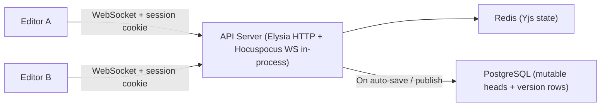

# SPEC-007 Editor, MDX, and Collaboration

This is the live canonical document under `docs/`.

## Editor & Post-MVP Real-Time Collaboration

### Editor Engine

The content editor is built on **TipTap**. MVP ships a single-user editor with Markdown/MDX serialization, draft autosave, and explicit publish/version-history flows. **Yjs/Hocuspocus-based multi-user collaboration is intentionally deferred to Post-MVP.**

> **TipTap & ProseMirror:** TipTap is a framework built on top of ProseMirror (the low-level editing engine by Marijn Haverbeke). TipTap provides the extension system, React integration, NodeViews, and developer-friendly APIs — but under the hood, every TipTap document is a ProseMirror document. When this spec refers to "ProseMirror document model," "node types," or "schema," it means TipTap's internal data structures inherited from ProseMirror. You interact with them through TipTap's API; direct ProseMirror imports are only needed for advanced custom extensions.

#### Markdown Serialization

Content is stored as Markdown/MDX text (`body` column) but edited via TipTap's internal document model. Bidirectional conversion between the two representations uses **`@tiptap/markdown`** (the official TipTap markdown extension, shipped in TipTap 3.7.0). It uses **Marked.js** as the parser/lexer and provides per-extension `markdown.parse` and `markdown.render` handlers.

**MDX component serialization** is handled by a custom layer on top of `@tiptap/markdown`:

1. A **custom Marked.js tokenizer** recognizes JSX block and inline syntax (`<ComponentName prop="value">...</ComponentName>`) during parsing and emits tokens for them.
2. A **custom TipTap extension** (`MdxComponent`) defines the node type with attrs (`componentName`, `props` as JSON) and provides the corresponding `markdown.parse` (token → node) and `markdown.render` (node → MDX string) handlers.
3. For wrapper components with `children`, the node uses a content hole that allows nested rich-text editing inside the component block.

This approach keeps MDX parsing/serialization within TipTap's standard extension model. If the custom Marked.js tokenizer proves insufficient for complex MDX (deeply nested components, JSX expressions in props), a fallback option is to swap the parsing layer to **remark + remark-mdx** (from the unified ecosystem) via `@handlewithcare/remark-prosemirror`, which provides a battle-tested MDX AST but is a smaller community project (~28 stars, from the NYT/moment.dev team).

**Round-trip idempotency requirement:** The serialization pipeline must satisfy `serialize(parse(markdown)) === markdown` for all content the schema produces. This prevents phantom diffs, where a cold-start load/save cycle produces byte-different but semantically identical content and causes unnecessary `draft_revision` churn. The CI suite must include round-trip fidelity tests for each schema type.

### Post-MVP Collaboration Architecture

The following subsection is a **future design target**, not an MVP transport contract.



Post-MVP design target:

- WebSocket endpoint: `/api/v1/collaboration`.
- Clients authenticate to WebSocket using the same Studio session (cookie-based) with strict `Origin` checking.
- Collaboration runs in the same Bun process as the API server via Hocuspocus + `ws` polyfill.
- Connection target is explicit via query params: `project`, `environment`, `documentId`.
- API keys are rejected for collaboration sockets.

#### Post-MVP Collaboration Authorization Flow

When the collaboration transport is implemented, WebSocket connect (`/api/v1/collaboration?project=...&environment=...&documentId=...`) must:

1. Validate `Origin` against the configured Studio allowlist (reject if mismatch).
2. Validate Studio session cookie with better-auth (reject unauthorized).
3. Validate explicit routing scope (`project`, `environment`) exists and is permitted for the authenticated user.
4. Load target `documentId` and assert it belongs to `(project, environment)`.
5. Evaluate folder/path RBAC for that document (`documents.path`) and require draft read/write access for collaboration.
6. Attach `{userId, sessionId, project, environment, documentId, role}` to the socket context.
7. On each write path (`onStoreDocument`, publish) re-check session validity; close socket (`4401`) if revoked/expired, or (`4403`) if permissions no longer allow access.

### State Management

**MVP source of truth hierarchy:** PostgreSQL `body` (markdown/MDX) is the canonical source of truth. The editor loads content from `documents.body`, maintains local TipTap state in the browser, and persists debounced draft saves back to PostgreSQL. Redis is not part of the MVP editor data path.

**MVP document load/save cycle:**

```
1. Load `body` from documents in PostgreSQL.
2. Parse markdown/MDX -> ProseMirror JSON in the editor.
3. On debounced save, serialize ProseMirror JSON -> markdown/MDX.
4. UPDATE documents SET body = $1, draft_revision = draft_revision + 1, has_unpublished_changes = TRUE.
```

**Post-MVP collaboration cache design:** When multi-user editing is reprioritized, Redis-backed Yjs state remains ephemeral and PostgreSQL remains canonical. The Yjs binary is never stored in PostgreSQL, and `onLoadDocument`/`onStoreDocument` must continue to rebuild from or flush back to canonical markdown/MDX text.

### Presence Awareness (Post-MVP)

Presence awareness is deferred to Post-MVP. When implemented, the server will track:

- Which users are online
- Which document each user is currently viewing or editing
- Cursor positions and selections within collaborative editing sessions

Presence indicators belong in the content list and editor only after the collaboration transport exists.

### Saving

There are two distinct save operations:

**Auto-save (draft):**

- Debounced: triggers ~5 seconds after the last change, or on editor blur/disconnect.
- Serializes the current TipTap document state to markdown + frontmatter.
- `UPDATE`s the `documents` row in place, sets `has_unpublished_changes = TRUE`, and increments `draft_revision`. No version history is created.
- Silent — no UI indication beyond a subtle "Saved" indicator.
- Does not depend on Redis, WebSocket sessions, or webhook fan-out in MVP.

**Publish (versioned):**

- Explicit user action (Publish button).
- Copies the current draft content into a new immutable row in `document_versions`.
- Optionally includes a change summary entered by the user.
- This is the only action that creates version history.

---

## MDX Component System

### Component Registration

Developers declare injectable MDX components in `mdcms.config.ts`:

```typescript
components: [
  {
    name: 'Chart',
    importPath: '@/components/mdx/Chart',
    load: () => import('@/components/mdx/Chart').then((m) => m.Chart),
    description: 'Renders a data chart with configurable options',
    // Optional: UI hints to override auto-detected form controls
    propHints: {
      color: { widget: 'color-picker' },
    },
  },
  {
    name: 'Callout',
    importPath: '@/components/mdx/Callout',
    description: 'Styled callout box with type variants (info, warning, error)',
  },
  {
    name: 'PricingTable',
    importPath: '@/components/mdx/PricingTable',
    load: () => import('@/components/mdx/PricingTable').then((m) => m.PricingTable),
    description: 'Configurable pricing table with tiers',
    // For complex props: developer provides a custom editor component
    propsEditor: '@/components/mdx/PricingTable.editor',
    loadPropsEditor: () =>
      import('@/components/mdx/PricingTable.editor').then((m) => m.default),
  },
],
```

`importPath` and `propsEditor` remain config-owned authoring metadata for local
extraction workflows. `load` and `loadPropsEditor` are host-local executable
loader callbacks used by the embedded Studio shell/runtime path. They are not
serialized into the shared normalized config shape or sent to the backend.

The local MDX component catalog is derived from `config.components` and carried into the embedded Studio runtime by the host app:

```typescript
export type MdxComponentCatalogEntry = {
  name: string;
  importPath: string;
  description?: string;
  propHints?: Record<string, unknown>;
  propsEditor?: string;
  extractedProps?: Record<string, unknown>;
};

export type MdxComponentCatalog = {
  components: MdxComponentCatalogEntry[];
};

export type MdxComponentHostCapabilities = {
  resolvePropsEditor: (name: string) => unknown | null;
};
```

The host app owns the executable capabilities. The embedded Studio runtime consumes:

- `catalog.components[*].extractedProps` for auto-generated form controls and fallback editing behavior
- `catalog.components[*].propHints` for widget overrides
- `resolvePropsEditor(...)` for custom editor resolution when `propsEditor` is configured

Executable editor values remain opaque at the shared contract layer (`unknown | null`).
In practice these are host-local React components resolved inside the embedding app bundle.

`importPath` and `propsEditor` remain config-owned authoring metadata. They identify the source modules used by the local extraction/runtime pipeline, but runtime resolution is keyed by component `name` rather than by path strings carried over the Studio boundary.

### Auto Prop Extraction

The CLI (during `cms init` or schema sync) parses the TypeScript source files at the specified `importPath` and automatically extracts prop type definitions. These prop types are stored in `catalog.components[*].extractedProps`, consumed by the embedded Studio runtime, and displayed in the Studio UI when inserting components.

Example: Given a component file:

```tsx
interface ChartProps {
  data: number[];
  type: 'bar' | 'line' | 'pie';
  title?: string;
  color?: string;
}

export function Chart({ data, type, title, color }: ChartProps) { ... }
```

The CLI extracts:

```json
{
  "name": "Chart",
  "props": {
    "data": { "type": "array", "items": "number", "required": true },
    "type": {
      "type": "enum",
      "values": ["bar", "line", "pie"],
      "required": true
    },
    "title": { "type": "string", "required": false },
    "color": { "type": "string", "required": false }
  }
}
```

**Props that cannot be CMS-edited** (function types like `onHover: () => void`, refs, etc.) are automatically excluded from the extracted schema and hidden from the CMS form. These props can only be set in code.

### Prop Type → Form Control Mapping

Auto-detected prop types map to form controls as follows:

| Prop Type                                  | Form Control              | Notes                    |
| ------------------------------------------ | ------------------------- | ------------------------ |
| `string`                                   | Text input                |                          |
| `number`                                   | Number input              |                          |
| `boolean`                                  | Toggle / checkbox         |                          |
| `'a' \| 'b' \| 'c'` (string literal union) | Dropdown select           |                          |
| `string[]`                                 | Tag input                 | Add/remove string values |
| `number[]`                                 | Repeatable number input   | Add/remove number values |
| `Date`                                     | Date picker               |                          |
| `string` with `.url()` hint                | URL input with validation |                          |
| `ReactNode` / `children`                   | Nested rich text editor   | See §18.5                |
| Function types                             | **Hidden**                | Not CMS-editable         |
| Ref types                                  | **Hidden**                | Not CMS-editable         |

### Widget Hints (Developer Overrides)

Developers can override the auto-detected form control by providing `propHints` in the component config. Available widgets:

| Widget         | Use Case                                                            |
| -------------- | ------------------------------------------------------------------- |
| `color-picker` | Color selection with visual picker                                  |
| `textarea`     | Multi-line text (instead of single-line input)                      |
| `slider`       | Number within a range: `{ widget: 'slider', min: 0, max: 100 }`     |
| `image`        | Image upload/selection (integrates with media system)               |
| `select`       | Force dropdown for any type: `{ widget: 'select', options: [...] }` |
| `hidden`       | Explicitly hide a prop from the CMS form                            |
| `json`         | Raw JSON editor for any prop                                        |

Auto-detection is the default. Hints override auto-detection. If a prop type is too complex for auto-detection and no hint or custom editor is provided, the prop is **hidden** from the CMS form (it can only be set in code).

### Custom Props Editors

For components with complex prop structures that can't be represented by auto-generated forms (e.g., a pricing table with nested tier objects, a data grid with column definitions), developers provide a **custom editor component**:

```typescript
// components/mdx/PricingTable.editor.tsx
import type { PropsEditorComponent } from '@mdcms/studio';

const PricingTableEditor: PropsEditorComponent<PricingTableProps> = ({
  value,    // Current prop values
  onChange, // Callback to update props
}) => {
  return (
    <div>
      {value.tiers.map((tier, i) => (
        <div key={i}>
          <input
            value={tier.name}
            onChange={(e) => {
              const newTiers = [...value.tiers];
              newTiers[i] = { ...tier, name: e.target.value };
              onChange({ ...value, tiers: newTiers });
            }}
          />
          {/* ... more fields */}
        </div>
      ))}
    </div>
  );
};

export default PricingTableEditor;
```

When `propsEditor` is specified in the component config, the Studio renders this custom editor instead of the auto-generated form. The custom editor receives the current props and an `onChange` callback — it has full control over the editing UX.

If a component has **no** `propsEditor` and some of its props are too complex for auto-generation, those specific props are hidden. Simple props are still auto-generated.

### Children / Nested Content

Components that accept `children` (content between opening and closing tags) are treated specially:

```mdx
<Callout type="warning">
  This is **important** markdown content inside the component.
</Callout>
```

In the editor, the children area is a **nested TipTap rich text editor** within the component's node view. This means content editors can use full markdown formatting (bold, links, lists, etc.) inside component blocks, and it participates in the Yjs collaboration session.

### Editor Integration (Node Views)

MDX components are rendered as **TipTap Node Views** — custom blocks within the editor document flow. The underlying representation and serialization are defined by the custom `MdxComponent` TipTap extension described in §10.1.1.

**Node type definition:**

MDX components are modeled as a single generic `MdxComponent` node type in TipTap's schema:

```typescript
// Simplified — the actual extension is more detailed
MdxComponent: {
  group: 'block',
  attrs: {
    componentName: { default: '' },   // e.g., "Chart", "Callout"
    props: { default: {} },           // JSON object of prop values
  },
  content: 'block*',                  // Content hole for children (wrapper components)
  // Void components (self-closing, no children) use content: '' instead
}
```

All registered MDX components share this single node type, differentiated by the `componentName` attr. This keeps the editor schema stable regardless of how many components are registered — adding a new component to `mdcms.config.ts` doesn't require schema changes.

**Insertion:**

1. User opens the component insertion panel (toolbar button or `/` slash command).
2. Panel lists all registered components from the local catalog with names and descriptions.
3. User selects a component.
4. The component is inserted into the document as a node view block.
5. Props form appears (auto-generated or custom editor) for initial configuration.

**Inline preview:**
Since the Studio is embedded in the user's app, the **actual React component** is rendered inside the node view using the current prop values. This resolution happens locally in the host app context, so content editors see exactly what the component will look like on the live site.

**Editing props:**

- Clicking/selecting a component node view reveals the props editing panel (displayed below the component preview or as a slide-out drawer).
- Changing any prop value immediately re-renders the live preview.
- The underlying MDX syntax (`<Chart data={[1,2,3]} type="bar" />`) is updated automatically — content editors never see or edit raw MDX syntax.

**Serialization:**
When the document is saved, the `MdxComponent` extension's `markdown.render` handler (§10.1.1) serializes each component node back to MDX syntax. Props are serialized as JSX attributes. Children (the content hole) are recursively serialized as markdown within the opening/closing tags. This MDX string is what gets stored in the `body` column of the database.

If a component specifies `propsEditor`, the embedded Studio runtime resolves that custom editor locally from the host bundle through `resolvePropsEditor(componentName)`. If no executable resolver exists for a registered component, the runtime falls back to the auto-generated form controls derived from `catalog.components[*].extractedProps`.

---

## Collaboration Endpoints

These routes are **Post-MVP**. They are intentionally omitted from the canonical MVP endpoint appendix in §24.

| Method | Endpoint                                                    | Description                                                                 |
| ------ | ----------------------------------------------------------- | --------------------------------------------------------------------------- |
| `WS`   | `/collaboration?project=...&environment=...&documentId=...` | Open real-time collaboration socket (session cookie required, no API keys). |
