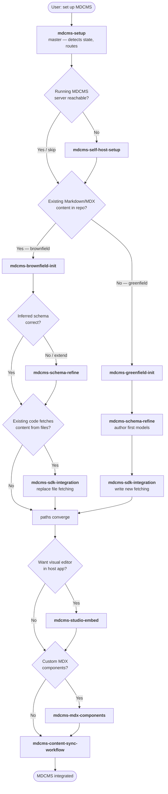

# MDCMS Skills Pack

Installable AI-agent skills that walk developers through adding MDCMS to a project — from bringing up a self-hosted backend to day-to-day `pull`/`push` automation.

The pack is designed to be installed into any agent environment supported by [skills.sh](https://skills.sh): Claude Code, Cursor, Gemini CLI, Codex, Copilot, OpenCode, and 40+ others.

## Install

```bash
# Browse available skills
npx skills add Blazity/mdcms --list

# Install all nine skills into the current project
npx skills add Blazity/mdcms

# Target a specific agent (default: prompt for agent)
npx skills add Blazity/mdcms -a claude-code

# Install globally (~/.<agent>/skills) so every project sees them
npx skills add Blazity/mdcms -g

# Non-interactive (CI / scripted install)
npx skills add Blazity/mdcms -y
```

The pack is installed into whichever agent directories the user selects (`~/.claude/skills/`, `~/.cursor/skills/`, etc.). All nine skills work best together because the master skill delegates to each of the focused skills by slug. Installing the whole pack is recommended.

See the [skills.sh CLI reference](https://github.com/vercel-labs/skills) for more options (`--copy`, `--skill`, `--agent`, update/remove commands).

## Skills at a glance

| Skill                                                                   | Purpose                                                                                                       |
| ----------------------------------------------------------------------- | ------------------------------------------------------------------------------------------------------------- |
| [`mdcms-setup`](./mdcms-setup/SKILL.md)                                 | **Master orchestrator.** Detects repo state and routes to the right focused skill for each phase. Start here. |
| [`mdcms-self-host-setup`](./mdcms-self-host-setup/SKILL.md)             | Stand up the MDCMS backend via Docker Compose. Env, first boot, admin bootstrap.                              |
| [`mdcms-brownfield-init`](./mdcms-brownfield-init/SKILL.md)             | Import an existing Markdown/MDX repo into MDCMS via `mdcms init --non-interactive`.                           |
| [`mdcms-greenfield-init`](./mdcms-greenfield-init/SKILL.md)             | Bootstrap MDCMS in an empty repo with a scaffolded starter.                                                   |
| [`mdcms-schema-refine`](./mdcms-schema-refine/SKILL.md)                 | Add/edit content types, fields, references; `mdcms schema sync`.                                              |
| [`mdcms-studio-embed`](./mdcms-studio-embed/SKILL.md)                   | Mount `<Studio />` at a catch-all route inside the user's host app.                                           |
| [`mdcms-sdk-integration`](./mdcms-sdk-integration/SKILL.md)             | Fetch content in the host app via `@mdcms/sdk`; drafts vs published; SSR.                                     |
| [`mdcms-mdx-components`](./mdcms-mdx-components/SKILL.md)               | Register custom MDX components so Studio preview and host SSR match.                                          |
| [`mdcms-content-sync-workflow`](./mdcms-content-sync-workflow/SKILL.md) | Day-to-day `pull`/`push`; key rotation; CI automation for publishing.                                         |

## How the skills flow

The master skill (`mdcms-setup`) walks through these phases and delegates at each branch:



## Assumptions and limitations

- Assumes the current MDCMS CLI contract. The `mdcms init --non-interactive` surface is required and ships with MDCMS `0.1.x+`.
- Skills reference `apps/studio-example` in the MDCMS source repo for copy-from patterns (Studio embed, MDX component registration). When the reference implementation changes, the skills defer to the reference.
- No assumption is made about the user's host framework beyond "React-based". Examples use Next.js App Router because it is the most common target; adapt for Remix, Astro, Vite, etc.
- The pack does not bundle an MCP server, hooks, or subagents. Claude Code users wanting `/slash` command shortcuts or MCP-backed integrations should install the pack alongside any project-specific `.claude/` config.

## Distribution conventions

- Each skill is a directory under this pack named `<slug>/`, containing a single `SKILL.md` with YAML frontmatter (`name`, `description`) and a markdown body.
- Skill slugs are stable and used for cross-references. Renaming a skill is a breaking change for consumers of the pack.
- New skills should follow the patterns already in this pack: pushy description, prerequisites, numbered steps, verification, gotchas, related skills, and a final assumptions/limitations note.

## Updating / removing

```bash
# Update all installed skills to their latest version
npx skills update

# Remove one
npx skills remove mdcms-setup

# Remove everything from this pack
npx skills remove --all --skill 'mdcms-*'
```

See `npx skills --help` for the full command surface.
